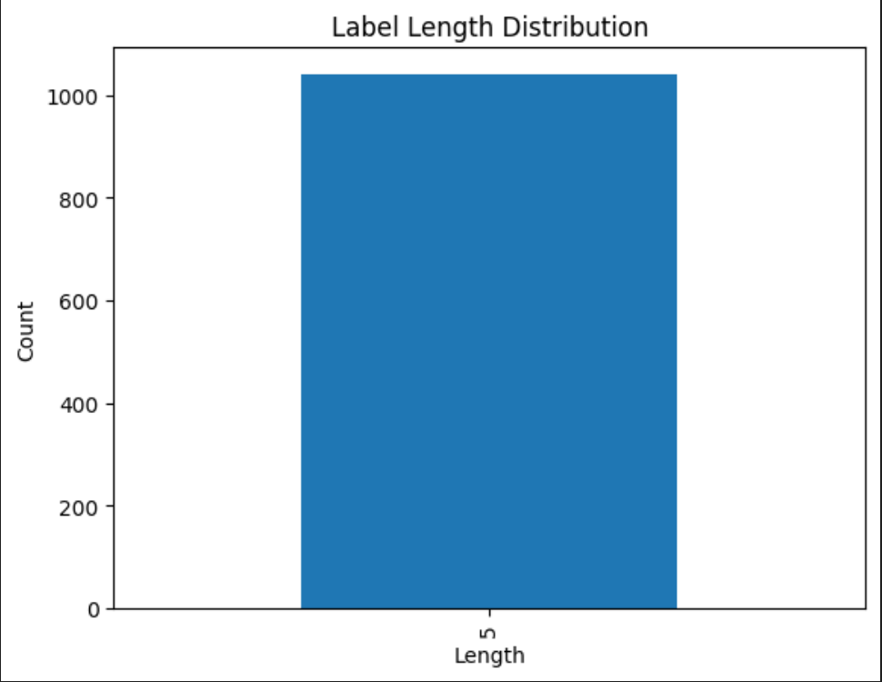
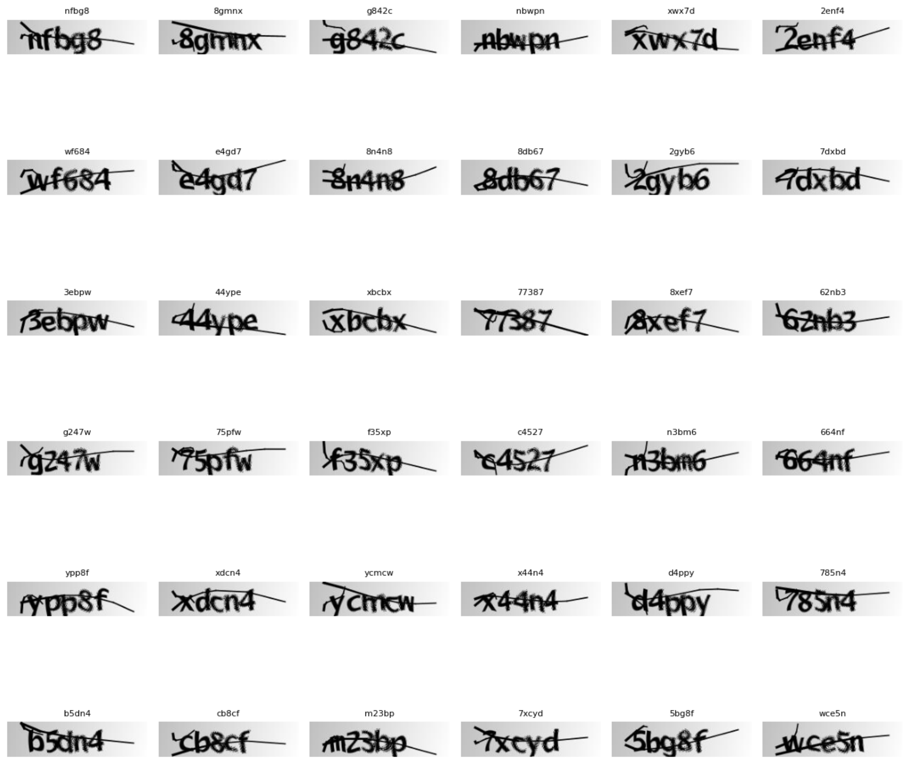
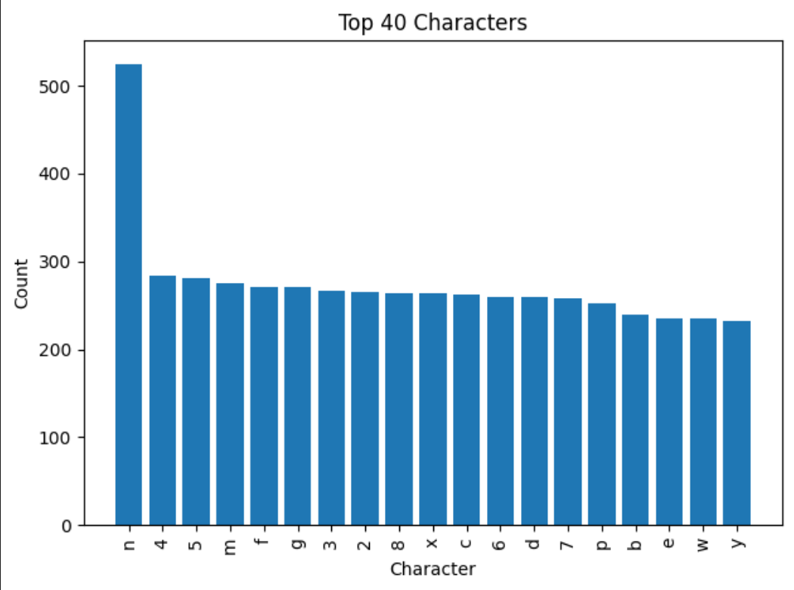
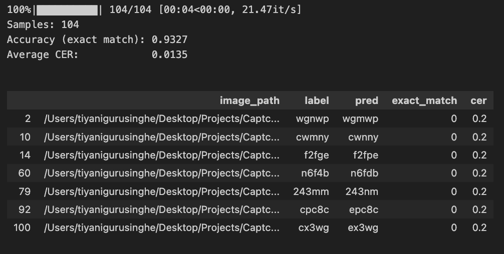
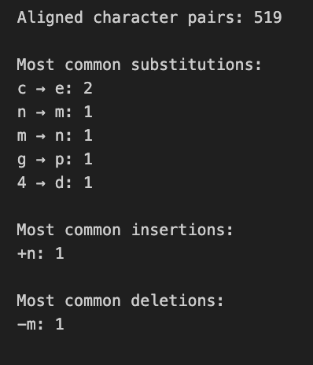
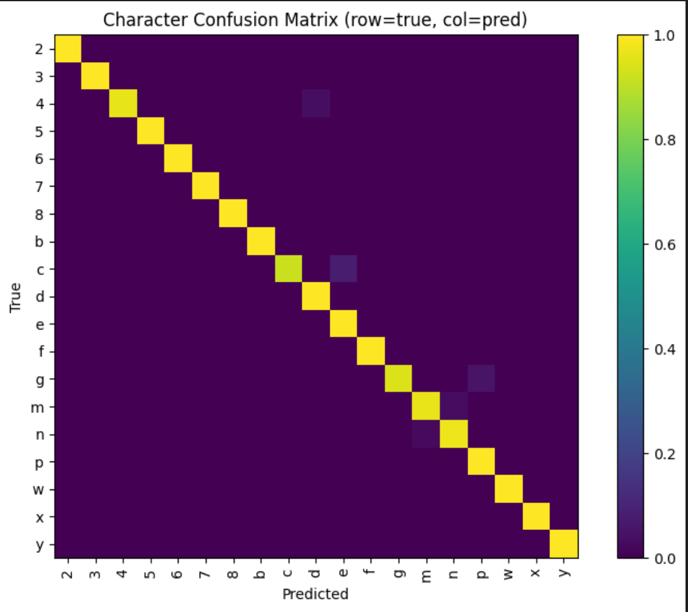
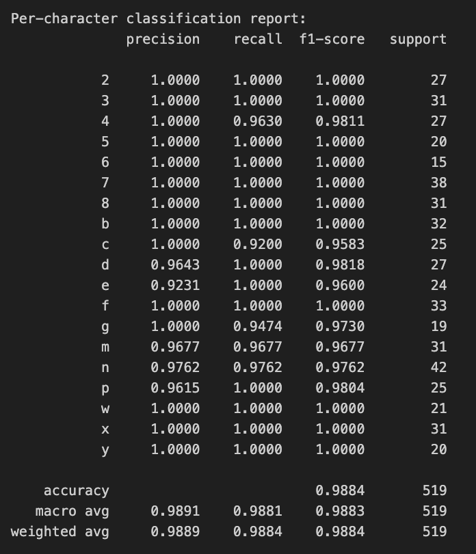

#  CaptchaSolver — CAPTCHA Image-to-Text Recognition  


## 🧭 Overview  

**CaptchSolver** is a deep learning–based OCR system that automatically decodes text from complex CAPTCHA images using a **CNN + Bi-LSTM + CTC** architecture.  
The project integrates preprocessing, training, evaluation, and deployment — culminating in a **Streamlit dashboard** for real-time predictions and visualization of OCR performance metrics.

## 🌐 Demo App Screenshots
[](https://github.com/Tiyani-source/CAPTCHA)

> Upload any CAPTCHA image to see decoded predictions, model confidence, and per-character analysis — all rendered on a modern Streamlit dashboard.

---

### 🏠 1. Home & Upload Interface  
**File:**  


> The app opens with a clean, dark-themed interface titled **“CAPTCHA OCR — Visual CAPTCHA Solver.”**  
> Users can:
> - Upload individual or multiple CAPTCHA images (`.png`, `.jpg`, `.jpeg`, `.bmp`, `.webp`)  
> - Upload an entire folder compressed as a `.zip`  
> - Load sample CAPTCHA images using the **🎁 Load Sample Set** button  
> - Clear uploaded samples or reset the entire session.  
> 
> Each upload is processed for prediction via the **▶️ Run Predictions** button.

---

### 📂 2. Selecting Files from Local Directory  
**File:**  


> When clicking **Browse Files**, the local file picker opens, allowing the user to select CAPTCHA images from their dataset folder.  
> In this example, a file named `2g783.png` is selected from the project’s `captcha_images_v2` directory.

---

### ✏️ 3. Entering CAPTCHA Labels  
**File:** 


> After uploading, the app automatically previews the image and provides an input box to manually type the correct CAPTCHA label.  
> You can either:
> - Manually enter labels (e.g., `2g783`)  
> - Or tick the checkbox **“My file/s name is the captcha true label/s”** for automatic labeling based on filenames.  
> 
> This label is later used to evaluate accuracy and **Character Error Rate (CER)**.

---

### ▶️ 4. Running Predictions  
**File:** `imgsScs/Screenshot_2025-10-20_01.13.55.png`  


> Once the correct label is entered, users can click **Run Predictions**.  
> The app runs inference using the trained **CNN + BiLSTM + CTC** model and outputs both the predicted text and comparison metrics.

---

### 📊 5. Dashboard Overview (Results Summary)  
**File:** `imgsScs/Screenshot_2025-10-20_01.14.04.png`  


> After prediction, the user is redirected to the **Dashboard** tab.  
> This page shows key metrics:
> - **Total CAPTCHA Samples**
> - **Exact Match Accuracy**
> - **Average Error Rate (CER)**
> 
> A detailed **Results Table** lists:
> - Image filename  
> - True label  
> - Predicted text  
> - Exact match status  
> - CER value  

---

### ✅ 6. Correct Predictions & Examples View  
**File:** `imgsScs/Screenshot_2025-10-20_01.14.13.png`  


> The **Examples** tab categorizes predictions into:
> - ✅ **Correct Predictions** — Ground truth and predicted text match perfectly.  
> - ❌ **Misreads** — Cases where the prediction differs (helpful for debugging OCR performance).  
> 
> Each entry also shows **CER (Character Error Rate)** and filename for quick reference.

---

### 🧩 7. Loading Sample CAPTCHAs  
**File:** `imgsScs/Screenshot_2025-10-20_01.14.35.png`  


> The app includes a **Load Sample Set** button that loads a pre-packaged set of CAPTCHA images from the `imgs/` folder for demo testing.  
> Each sample appears with its filename (serving as ground truth).  
> Users can instantly test model performance without external uploads.

---

### 📦 8. Uploading a ZIP Folder of CAPTCHAs  
**File:** `imgsScs/Screenshot_2025-10-20_01.14.51.png`  


> The upload panel supports folder uploads in `.zip` format, allowing batch predictions.  
> The app automatically extracts the archive and processes all CAPTCHA images within it.

---

### ⚙️ 9. ZIP Extraction and Batch Prediction  
**File:** 


> Once uploaded, a message confirms:  
> *“Folder uploaded and extracted to a temporary directory.”*  
> The extracted images appear in the interface, ready for batch prediction.  
> Press **Run Predictions** to evaluate the entire set at once.

---

### 📈 10. Performance Dashboard (Batch Run Example)  
**File:** 


> The dashboard updates dynamically after batch processing:  
> - Displays the total number of CAPTCHA samples tested.  
> - Computes accuracy and CER for all predictions.  
> - Populates a scrollable table with image paths, true labels, predictions, and error metrics.  
> 
> This provides a transparent evaluation of the model’s real-world OCR performance.

---

### 🧭 Summary of Features

- 🖼️ **Image Upload & Previews** — Real-time display of uploaded CAPTCHAs.  
- 🏷️ **Label Entry System** — Manual or automatic labeling using filenames.  
- 🧠 **Model Inference (CNN + BiLSTM + CTC)** — Predicts CAPTCHA text and computes metrics.  
- 📊 **Interactive Dashboard** — Accuracy, CER, and visual results table.  
- 📦 **ZIP Batch Upload Support** — Extracts and evaluates multiple CAPTCHAs.  
- 🎯 **Clean, Dark UI** — Modern Streamlit layout optimized for clarity and accessibility.

---

> 📍 *All screenshots are captured from the local app running in developer mode.*  
> This documentation section is designed to help readers explore the app features even without a deployed live demo.

---

## ⚙️ Technical Stack  

| Category | Technologies |
|-----------|---------------|
| **Language** | Python 3.10 + |
| **Frameworks** | TensorFlow / Keras 3 |
| **Libraries** | NumPy, Pandas, Matplotlib, OpenCV |
| **OCR Logic** | CNN + Bi-LSTM + CTC Decoder |
| **Frontend / App** | Streamlit |
| **Metrics** | Accuracy (Exact Match), CER, WER, Confusion Matrix |
| **Visualization** | Matplotlib / Seaborn |
| **Deployment** | Streamlit Cloud / Local |

## 🧰 Local Deployment  

### 1️⃣ Clone & Setup  
```bash
git clone https://github.com/<your-username>/CaptchSolver.git  
cd CaptchSolver  
python3 -m venv venv  
source venv/bin/activate  
pip install -r requirements.txt
```

2️⃣ Run App

streamlit run app.py


## 📦 Repository Structure  
```bash
CAPTCHA/
│
├── captcha_images_v2/         # Dataset folder
├── imgs/                      # Sample CAPTCHA images
├── imgsScs/                   # Captured screenshots and results
├── app.py                     # Main Streamlit app
├── captchsolver.ipynb         # Model training & evaluation notebook
├── configs.yaml               # Model and preprocessing config
├── model.h5                   # Trained CNN+BiLSTM+CTC model
├── requirements.txt           # Dependencies for app deployment
├── LICENSE                    # License file
├── README.md                  # Documentation
├── logs.log                   # Optional app run logs
└── script/                    # Utility or shell scripts
```

## 🧮 Dataset Overview  

**Source:** A curated dataset of synthetic CAPTCHA images labeled via filenames (e.g., `4fp5g.png → "4fp5g"`).  
Images contain alphanumeric sequences over cluttered backgrounds with rotation and noise.

| Metric | Value |
|--------|--------|
| Total Images | **1 040** |
| Format | `.png` |
| Average Label Length | **5 characters** |
| Dimensions | **200 × 50 px** |
| Unique Characters | **19 letters + digits** |
| Label Origin | Derived from filenames |

### 📋 Data Integrity Check  

Total images: 1040
Unique stems (label candidates): 1040
Same label across multiple extensions: 0


## 📊 Exploratory Data Analysis  

### 1️⃣ Label Length Distribution  
  
All labels contain exactly **5 characters**, simplifying sequence modeling and padding.


### 2️⃣ Sample CAPTCHA Grid  
  
The dataset shows mild skew, rotation, and overlapping strokes — ideal for real-world OCR robustness.

### 3️⃣ Image Dimensions Consistency  
Every image is precisely **200×50 px**, enabling fixed input resizing and CNN efficiency.

### 4️⃣ Character Frequency Distribution  
  
Top characters: `n(525)`, `4(284)`, `5(281)`, `m(275)`, `f(271)`, `g(271)`...  
Balanced representation avoids over-training on any specific class.

> ⚖️ **Balanced vocabularies** improve OCR generalization and decoding reliability.


## 🧠 Model Architecture  

**Architecture Summary**

| Component | Description |
|------------|-------------|
| **Feature Extractor** | Convolutional + BatchNorm + ReLU + MaxPool |
| **Sequence Modeler** | 2-layer Bidirectional LSTM |
| **Decoder** | CTC (Connectionist Temporal Classification) |
| **Loss** | CTC Loss |
| **Optimizer** | Adam (1e-4 lr) |


## 🧪 Evaluation Notebook Summary  

### 🧾 Validation Data Loading  

Loads pairs from `val.csv` or auto-labels from folder structure.  
Ensures (image_path, label) pairs are generated for validation.


### 🔍 Model Evaluation Workflow  


| Step | Operation | Description |
|------|------------|-------------|
| 1 | `predict_text()` | Runs inference on each image |
| 2 | `get_cer()` | Computes Character Error Rate |
| 3 | `pred == label` | Checks Exact Match accuracy |
| 4 | Record Results | Stores outputs in DataFrame |


### 📈 Model Metrics  
| Metric | Result |
|---------|--------|
| **Exact Match Accuracy** | 0.9327 (93.2 %) |
| **Average CER** | 0.0135 (1.35 %) |
| **Average WER** | 0.0153 (1.53 %) |

| Example | Label | Prediction | CER |
|----------|-------|-------------|-----|
| wgnwp | wgmwp | 0.2 |
| cwmny | cwnny | 0.2 |

> Minor errors arise from visually similar glyphs (`n ↔ m`, `g ↔ p`, `c ↔ e`).

---

### 🧩 Character-Level Error Analysis  


**Aligned Character Pairs:** 519  

| Type | Example |
|------|----------|
| Substitutions | `c → e`, `n → m`, `4 → d` |
| Insertions | `+n` |
| Deletions | `–m` |


### 🎛 Confusion Matrix  
  
Diagonal (yellow) = correct predictions   
Off-diagonal (purple) = shape confusions  
> Sparse off-diagonals ≈ **99 % per-character accuracy**


### 📜 Per-Character Classification Report  


| Metric | Macro Avg | Weighted Avg |
|---------|-----------|--------------|
| Precision | 0.989 | 0.989 |
| Recall | 0.988 | 0.988 |
| F1-Score | 0.988 | 0.988 |

> Minor drops for `c`, `e`, `g`, `m/n` — typical OCR confusions.  
> Overall OCR fidelity ≈ **98.8 % per character**

---

### 🧮 WER (Word Error Rate)  
```bash
WER = (Substitutions + Insertions + Deletions)/(Length(GroundTruth)
```
**Average WER:** 0.01538 → ~1.5 % token error.  

## 🏁 Final Summary  

| Aspect | Description | Key Takeaway |
|---------|--------------|--------------|
| **Dataset** | 1 040 CAPTCHAs (200×50 px) | Uniform + balanced |
| **Architecture** | CNN + Bi-LSTM + CTC | Sequential OCR pipeline |
| **Accuracy** | 93 % exact match | Strong sequence decoding |
| **Per-Char F1** | 98.8 % | Robust character recognition |
| **CER / WER** | 0.013 / 0.015 | Minimal textual distortion |
| **Top Confusions** | n↔m, c↔e, g↔p | Shape similarity errors |
| **Deployment** | Streamlit App | Real-time visual OCR demo |


# 🧑‍💻 Contributor
	•	Tiyani Gurusinghe — Developer


📘 CaptchSolver demonstrates an end-to-end OCR workflow — from CAPTCHA preprocessing and EDA to model training and Streamlit deployment — achieving human-level recognition accuracy  with interpretability metrics (CER, WER, confusion heatmaps).

# 📜 License

MIT License © 2025 Tiyani Gurusinghe
